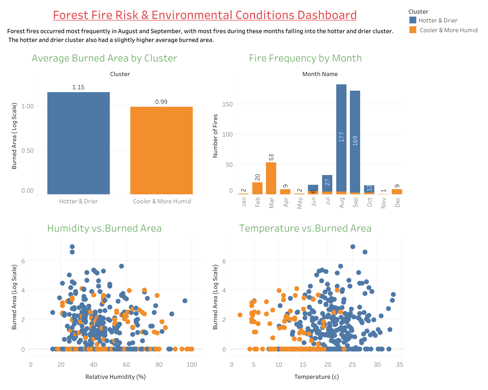
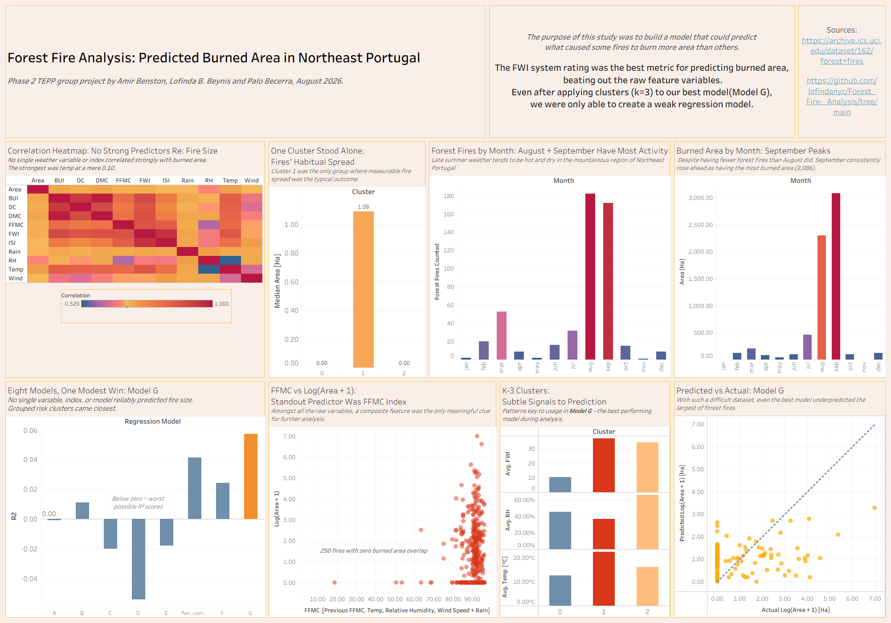

# 🔥 Forest Fire Analysis & Prediction

> **Data Analytics Capstone Project --- The Knowledge House**


This machine learning project explores forest fire activity in **Montesinho Natural Park,
Portugal**, using:

- Exploratory Data Analysis 

- Preprocessing 

- Fire Weather Index variables

- K-Means Clustering

- Regression Modeling

- Tableau Dashboard

- Final Report

Our central question was:

**Can weather conditions, fire-weather indicators, location, and
seasonal patterns help us understand forest fire activity and burned
area?**

------------------------------------------------------------------------

## 📊 Dashboard




### At a Glance

-   🔥 Fire activity peaks in **August and September**
-   📈 September records the greatest total burned area
-   🌡️ Peak fire months are dominated by **hotter and drier conditions**
-   🧩 K-Means found **3 main environmental clusters**
-   🎯 Best clustering result: **Cluster 1 from K = 3 - Hot Dry High Risk Group**
-   ⚠️ Weather and fire-weather indicators provide useful context, but
    no single variable strongly explains exact burned area

------------------------------------------------------------------------

## 👥 Team

  **Name         |     Role      |    Contributions**
  -------------    -------------   -------------------
  Palo Becerra   |  Data Analyst | Team Lead - facilitated group discussions to consolidate findings into a shared analysis plan, conducted independent EDA, designed and built the final Tableau dashboard, authored the Final Report, and contributed to the project repo as needed.
  
  Lofinda Beynis |  Data Analyst | Repo Lead - 
  
  Amir Benston   |  Data Analyst | Model Lead - 

------------------------------------------------------------------------

## 📁 Dataset

The project uses the **Forest Fires Dataset** from the UCI Machine
Learning Repository.

The raw dataset contains **517 observations and 13 variables**
describing spatial location, calendar information, weather conditions,

Fire Weather Index components, and burned area.

### Main Variables

  Variable     Description
  ------------ -------------------------------
  X, Y    :     Spatial coordinates
  
  month, day :  Calendar information
  
  FFMC :        Fine Fuel Moisture Code
  
  DMC  :        Duff Moisture Code
  
  DC    :       Drought Code
  
  ISI    :      Initial Spread Index
  
  temp    :     Temperature (°C)
  
  RH    :       Relative humidity (%)
  
  wind   :      Wind speed
  
  rain   :      Rainfall
  
  area   :      Forest area burned (hectares)
  
  log_area  :   Log transformed area - Engineered Feature
  
  FWI   :       Fire Weather Index - Engineered Feature
  
  BUI     :     Buildup Index - Engineered Feature

------------------------------------------------------------------------

## 🔎 Exploratory Data Analysis

EDA was used to understand the structure of the data, identify seasonal
patterns, examine burned-area behavior, and explore relationships
between environmental variables.

### Data Quality

-   **517** original observations
-   **0 missing values**
-   **4 exact duplicate rows**
-   **513 observations** remained after duplicate removal

### Burned Area

Burned area is highly right-skewed. Most fires burned relatively small
areas, while a small number of observations represent much larger fires.

**247 of the 517 raw observations (47.8%) report 0 hectares burned.**

To reduce the effect of extreme values, we created:

`log_area = log(1 + area)`

### Seasonal Patterns

The strongest descriptive pattern is the concentration of forest fire
activity in late summer.

-   **August:** 184 observations
-   **September:** 172 observations
-   **September:** greatest total burned area

This distinction is important: the month with many fires is not
necessarily the month with the same pattern of fire severity.

### Correlation Findings

No individual numerical feature showed a strong linear relationship with
burned area.

The EDA therefore suggests that **fire severity cannot be explained by
one weather or Fire Weather Index variable alone**.

------------------------------------------------------------------------

## ⚙️ Data Preprocessing

The preprocessing stage prepared the data for clustering and further
analysis.

Key steps included:

-   Removing 4 duplicate records
-   Confirming no missing values
-   Creating `log_area`
-   One-hot encoding `month` and `day`
-   Preventing target leakage by excluding `area` and `log_area` from
    the predictor matrix
-   Producing **29 predictor variables**

### Final Processed Data

**513 observations × 31 columns**

Primary transformed outcome:

`log_area`

Processed file:

`Data/processed/forestfires_processed.csv`

------------------------------------------------------------------------

## 🌡️ Fire Weather Index Analysis

The project also includes an extended dataset containing Fire Weather
Index-related information.

The analysis explores how weather conditions and FWI components interact
with forest fire behavior. While these indicators help characterize
environmental fire conditions, the analysis again shows that **no single
feature is a strong standalone explanation of burned area**.

File:

`Data/processed/forestfires_with_fwi.csv`

------------------------------------------------------------------------

## 🧩 Unsupervised Learning --- K-Means

K-Means clustering was used to determine whether forest fire
observations naturally separate into meaningful environmental groups.

### Clustering Features

Seven standardized variables were used:

-   FFMC
-   DMC
-   DC
-   ISI
-   Temperature
-   Relative humidity
-   Wind

Burned area was intentionally **not used to create the clusters**.

### Why Rain Was Excluded

Rain was zero in **505 of 513 observations (98.4%)**.

Because K-Means relies on distance, the few non-zero rain observations
could disproportionately affect the clustering solution. Rain was
therefore excluded from the final clustering features.

### Selecting the Number of Clusters

Solutions from **K = 2 through K = 6** were compared using the elbow
method and silhouette score.

**Best solution:**

  Metric             Result
  ------------------ -----------
  Selected K         **2**
  Silhouette Score   **0.376**

### Cluster Interpretation

The two groups were interpreted as:

**Cluster 1 --- Hotter & Drier**

Higher temperatures and generally stronger fire-danger conditions.

**Cluster 2 --- Cooler & More Humid**

Lower temperatures and somewhat higher humidity.

After the clusters were created, burned area was compared between them.

The **Hotter & Drier** cluster showed a slightly higher average burned
area, but the distributions overlapped substantially.

### What This Means

The clustering identifies meaningful environmental profiles, but those
profiles **do not fully determine how large a fire becomes**.

Cluster assignments are stored in:

`Data/processed/forestfires_with_clusters.csv`

------------------------------------------------------------------------

## 📈 Tableau Analysis

### Forest Fire Risk & Environmental Conditions Dashboard

The primary dashboard communicates the relationship between seasonality,
environmental clusters, and burned area.

It includes:

-   Fire frequency by month
-   Average burned area by cluster
-   Humidity vs. burned area
-   Temperature vs. burned area

### Dashboard Findings

The dashboard shows that:

-   August and September dominate forest fire activity
-   Peak fire months contain many Hotter & Drier observations
-   Hotter & Drier conditions have a slightly higher average log burned
    area (**1.15 vs. 0.99**)
-   Considerable variation remains within both clusters

### Additional Forest Fire Analysis

The `Forest_Fire_Analysis_PD` Tableau analysis provides additional views
of:

-   Fire activity by month
-   Burned area by month
-   Correlation patterns
-   FWI-related features
-   Cluster comparisons
-   Regression-model comparisons
-   Predicted vs. actual burned-area results

The additional analysis reinforces the central finding that **exact
burned area is difficult to predict from the available environmental
variables**.

------------------------------------------------------------------------

## 💡 What We Learned

### Environmental Insight

Forest fire activity in this dataset is strongly seasonal. **August and
September** account for most observations, and hotter/drier
environmental conditions are especially common during this period.

### Analytical Insight

Environmental variables are useful for identifying **fire-weather
patterns**, but they are much less effective at explaining the exact
amount of land burned.

### Machine Learning Insight

K-Means successfully separates the observations into interpretable
environmental groups, but substantial overlap in burned-area outcomes
remains between the clusters.

### Main Limitation

The available dataset captures important weather and fire-danger
information, but forest fire severity is complex. Factors not
represented in the dataset may also influence how large an individual
fire becomes.

------------------------------------------------------------------------

## 🗂️ Repository Structure

``` text
TEPP_CAPSTONE_PROJECT/
│
├── Dashboard/
│   ├── Forest_Fire_Analysis_PD.pdf
│   ├── Forest_Fire_Analysis_PD.twb
│   ├── forest_fire_dashboard.png
│   └── forestfires_tableau.csv
│
├── Data/
│   ├── processed/
│   │   ├── forestfires_processed.csv
│   │   ├── forestfires_with_clusters.csv
│   │   └── forestfires_with_fwi.csv
│   └── raw/
│       └── forestfires.csv
│
├── Docs & Resources/
│
├── Notebooks/
│   ├── amir_eda.ipynb
│   ├── lofinda-eda.ipynb
│   ├── Palo_eda.ipynb
│   ├── preprocessing.ipynb
│   └── unsupervised_learning.ipynb
│
├── .gitignore
└── README.md
```

------------------------------------------------------------------------

## 🛠️ Tools & Technologies

**Python** • **Pandas** • **NumPy** • **Matplotlib** • **Seaborn** •
**Scikit-learn** • **Jupyter Notebook** • **Tableau** • **Git** •
**GitHub** • **VS Code**

------------------------------------------------------------------------

## 🎯 Conclusion

## 📊 Final Dashboard



This project combined exploratory data analysis, preprocessing, Fire
Weather Index analysis, K-Means clustering, regression analysis, and
Tableau visualization to better understand forest fire behavior.

The analysis identified a strong seasonal pattern, with fire activity
concentrated in **August and September**. K-Means also revealed distinct
environmental profiles, particularly hotter/drier and cooler/more-humid
conditions.

However, the correlation and regression analyses showed that
**predicting exact burned area remains challenging**. The available
weather and fire-weather variables provide useful information about the
conditions associated with forest fires, but they have limited ability
to explain the severity of an individual fire.

Overall, the project shows that environmental data is valuable for
identifying **when and under what conditions fire activity is more
common**, while accurately predicting **how much area will burn**
requires additional information and potentially more advanced data or
modeling approaches.
